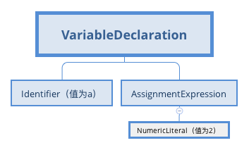

## 第1章 作用域是什么

存储和访问（或修改）变量的值的能力将`状态`带给了程序。

一套**设计良好的规则**来`存储`变量，并且之后可以方便地`找到`这些变量 => 这套规则被称为**作用域**

在哪里而且怎样设置这些作用域的规则呢？


### 1.1 编译原理

通常将JavaScript归类为”动态“或”解释执行“语言，但事实上它是一门编译语言。但与传统的编译语言不同，它`不是`提前编译的，编译结果也不能在分布式系统中进行移植。

JavaScript引擎进行编译的步骤和传统的编译语言**非常相似**，在某些环节可能比预想的要复杂。

在传统编译语言的流程中，程序中的**源代码在执行之前会经历三个步骤**，统称为”**编译**“：

* 分词/词法分析 Tokenizing / Lexing  （词法化/单词化）

  将由字符组成的字符串`分解成`（对编程语言）**有意义的代码块**。

  这些代码块被称为词法单元（token）。（空格是否会被当作词法单元，取决于空格在一门语言中是否具有意义）

  分词tokenizing和词法分析lexing之间的区别：主要差异在于**词法单元的识别**是通过有状态还是无状态的方式进行的。

  词法单元生成器—（有状态的解析规则）—>词法分析

* 解析/语法分析 Parsing

  将词法单元流（数组）`转换成`一个由元素逐级嵌套所组成的**代表了程序语法结构的树**。

  这棵树被称为”抽象语法树“（Abstract Syntax Tree，AST）。

  🌰：

  `var a = 2;`

  => 

* 代码生成

  将AST`转换为`**可执行代码**的过程。=>与语言、目标平台等息息相关。

  简单来说，就是用某种方法将AST转化为**一组机器指令**，将例子`var a = 2;`创建一个叫作a的变量（包括分配内存等），并将一个值存储在a中。

比起三个步骤，JavaScript引擎还要复杂许多。如在语法分析和代码生成阶段有特定的步骤来**对运行性能进行优化**，包括对冗余元素进行优化等。

传统编译：


JavaScript引擎不会有（像其他语言编译器）那么多的时间用来进行优化，因为JavaScript的编译过程不是发生在构建之前。

对JavaScript来说，大部分情况下编译发生在**代码执行前的几微妙（甚至更短！）**的时间内。

JavaScript引擎用尽了各种办法（如JIT，可以延迟编译甚至实施重编译）来保证性能最佳。

编译 ——> 做好执行准备 ——> 执行


### 1.2 理解作用域

模拟人物对话    例子：`var a = 2;`

#### 1.2.1 演员表

参与处理过程的演员们：

* 引擎

  从头到尾负责整个JavaScript程序的编译及执行过程。

* 编译器

  引擎的好友之一，负责语法分析及代码生成等。

* 作用域

  引擎的另一位好友，负责**收集并维护**由所有声明的标识符（变量）组成的一系列查询，并**实施一套非常严格的规则**，确定当前执行的代码对这些标识符的`访问权限`。

#### 1.2.2 对话

对于上述例子，引擎认为有两个完全不同的声明，一个由编译器在`编译时`处理，另一个则由引擎在`运行时`处理。

在代码生成阶段（编译的第三步），**编译器会进行如下处理**：

1. 遇到`var a`，编译器会**询问**作用域是否已有一个该名称的变量存在于同一个作用域的集合中。如果是，则忽略该声明，继续进行编译；否则要求作用域在当前作用域的集合中声明一个新的变量，并命名为a。
2. 编译器会为引擎**生成**运行时所需的代码，这些代码被用来处理`a = 2`这个赋值操作。

**引擎的处理**：

引擎在运行时会首先**询问**作用域（LHS查询），在当前的作用域集合中是否存在一个叫作a的变量。如果是，引擎就会使用这个变量；否则，引擎会继续查找该变量（沿作用域链）；如果最终找到变量a，就会将2赋值给它；否则引擎就会抛出异常！

**总结**：

变量的赋值操作会执行两个动作。**首先**编译器会在当前作用域中声明一个变量（如果之前没有声明过），**然后**在运行时引擎会在作用域中查找该变量，如果能够找到就会对它赋值。

#### 1.2.3 编译器有话说

引擎在执行代码时，会通过查找变量a来判断它是否已声明过。

查找的过程由作用域进行协助，但**引擎**执行怎样的查找，会影响最终的查找结果。

**LHS查询 & RHS查询**（在作用域查找）

一个赋值操作的左侧和右侧。

RHS查询与简单地查找某个变量的值别无二致，而LHS查询则是试图找到变量的容器本身，从而可以对其赋值。

=》 RHS并不是真正意义上的”赋值操作的右侧“，更准确地说是**”非左侧“**。

LHS引用并不关心当前的值是什么，只是想要为`= 2`这个赋值操作找到一个目标。

赋值操作还有其他几种形式，因此在概念上最好理解为”赋值操作的目标是谁（**LHS**¹）“以及”谁是赋值操作的源头（**RHS**²）“。

¹目的赋值，对变量进行赋值。找到变量的容器本身

²目的取值，获取变量的值

如将函数声明 `function foo (a) { ... }`概念化为普通的变量声明和赋值，比如 `var foo、 foo = function (a) { ... }`。如果这样理解，这个函数声明将需要进行LHS查询。

然而，编译器可以在代码生成的同时处理声明和值的定义，但在引擎执行代码时，并**不会**有线程专门用来将一个函数值”分配给“foo。因此，将函数声明理解成前面讨论的LHS查询和赋值的形式**并不合适**。

#### 1.2.4 引擎和作用域的对话

例子：

```javascript
function foo( a ) {
  console.log( a );
}
foo( 2 );
```

查询过程：

foo          RHS引用

a = 2       隐式赋值，LHS引用

console  RHS引用，.log 对象属性访问规则

a              RHS引用

#### 1.2.5 小测验

```javascript
function foo( a ) {
  var b = a;
  return a + b;
}
var c = foo( 2 );
```

1. 找出所有LHS查询（3处）
2. 找出所有RHS查询（4处）


### 1.3 作用域嵌套

**当一个块或函数嵌套在另一个块或函数中时，就发生了作用域的嵌套。**

当前作用域中无法找到某个变量时，引擎就会在外层嵌套的作用域中继续查找，**直到找到**该变量，**或抵达最外层**的作用域为止（全局作用域）

当抵达最外层的全局作用域时，无论找到还是没找到，查找过程都会停止。


### 1.4 异常

为什么区分LHS和RHS？

在变量还没有声明（在任何作用域）的情况下，这两种查询的行为是不一样的。

如果**RHS查询遍寻不到**所需的变量，引擎就会抛出`ReferenceError`异常。

当引擎执行**LHS查询时无法找到**目标变量，全局作用域中就会创建一个具有该名称的变量，并将其返还给引擎。（**非”严格模式“**）

（在**严格模式下**）**LHS查询失败时**，会抛出同RHS查询失败时类似的`ReferenceError`异常。（严格模式禁止自动或隐式地创建全局变量）

如果**RHS查询成功，但对这个变量的值进行不合理的操作**（如对非函数类型的值进行函数调用，或引用null/undefined类型的值中的属性），引擎会抛出另一种类型的异常，叫作`TypeError`。

`ReferenceError`同作用域判别失败相关，而`TypeError`则代表作用域判别成功了，但对结果的操作是非法或者不合理的。


​	

