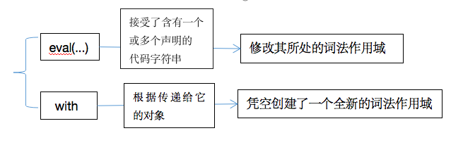
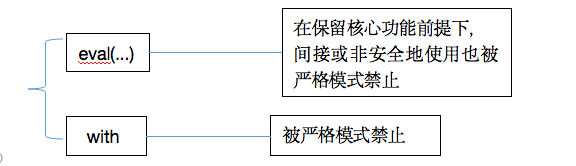

## 第2章 词法作用域

作用域共有两种主要的工作模型。

一种最为普遍的，是词法作用域；另一种是动态作用域，仍有一些编程语言在使用（如Bash脚本、Perl中的一些模式等）

动态作用域是JavaScript另一个重要机制`this`的表亲。

词法作用域**最重要的特征**是它的定义过程发生在**代码的书写阶段**（在何处声明）（在没有使用eval或with的情况下）

动态作用域只关心函数**从何处调用**。作用域链是**基于调用栈**（从何处调用）的，而不是代码中的作用域嵌套。

this机制某种程度上很像动态作用域。（在运行时确定）


### 2.1 词法阶段

词法作用域就是**定义在词法阶段**的作用域。

当***词法分析器***处理代码时会保持作用域不变（大部分情况下）。

（一个非常好的最佳实践）

***查找**：

作用域的结构和互相之间的位置关系给引擎提供了足够的位置信息，引擎用这些信息来查找标识符的位置。

作用域查找会在<u>找到第一个匹配的标识符</u>时停止。在多层的嵌套作用域中可以定义同名的标识符，这叫作”**遮蔽效应**“。

**全局变量**会自动成为全局对象（如window）的属性，因此可以不直接通过词法名称，而是间接地通过对全局对象属性的引用来对其进行访问。=》可以访问那些被同名变量所遮蔽的全局变量。（window.a）

函数的词法作用域都***只***<u>由函数被声明时</u>所处的位置决定。（与在哪里调用和如何被调用无关）

词法作用域查找***只***会<u>查找一级标识符</u>，如a、b、c。如果代码中引用了形如foo.bar.baz，词法作用域查找只会试图查找foo标识符，找到这个变量后，**对象属性访问规则**会分别接管对bar和baz属性的访问。


### 2.2 欺骗词法

在运行时来”修改“（欺骗）词法作用域。

有两种机制来实现这个目的。**最重要的点**：欺骗词法作用域会导致性能下降。

#### 2.2.1 eval

`eval(...)`函数可以接受一个字符串为参数，并将其中的内容视为好像在书写时就存在于程序中这个位置的代码。

《=》可以在书写的代码中**用程序生成代码并运行**，就好像代码是写在那个位置的一样。

=》通过代码欺骗和假装成书写时（也就是词法期）代码就在那，来实现**修改词法作用域**环境。

在执行`eval(...)`之后的代码时，引擎并不”知道“或”在意“前面的代码是**以动态形式**插入进来，并对词法作用域的环境进行修改的。引擎只会如往常地进行词法作用域查找。

🌰：

```javascript
function foo( str, a ) {
  eval( str );
  console.log( a, b );
}
var b = 2;
foo( "var b = 3;", 1 ); // 1, 3
// 对已经存在的foo(...)的词法作用域进行了修改
// eval(...)通常被用来执行动态创建的代码（根据程序逻辑动态地拼接字符）
```

默认情况下，如果`eval(...)`中所执行的代码包含有一个或多个声明（无论是变量还是函数），就会对`eval(...)`所处的词法作用域进行修改。

在**严格模式**下，`eval(...)`在运行时有其<u>自己的词法作用域</u>，意味着其中的声明无法修改所在的作用域。

🌰：

```javascript
function foo( str ) {
  "use strict";
  eval( str );
  console.log( a );
}
foo( "var a = 2;" ); // ReferenceError: a is not defined.
```

JavaScript中还有其他一些与`eval(...)`相似效果的东西。`setTimeout(...)`和`setInterval(...)`的第一个参数可以是字符串。**不建议使用！**

`new Function (...)`函数的行为也类似，最后一个参数可以接受代码字符串，并将其转化为动态生成的函数（前面的参数是新生成的函数的形参）。这种构建函数的语法比`eval(...)`略微安全，但也**尽量避免使用**！

在程序中动态生成代码的使用非常罕见，因为它所带来的好处无法抵消性能上的损失。

#### 2.2.2 with

with关键字

`with`通常被当作**重复引用同一个对象**中的多个属性的快捷方式，可以不需要重复引用对象本身。

🌰：

```javascript
var obj = {
  a: 1,
  b: 2,
  c: 3
};
obj.a = 2;
obj.b = 3;
obj.c = 4;
with( obj ) {
  a = 3;
  b = 4;
  c = 5;
}
```

但实际上，这不仅仅是为了方便地访问对象属性。

🌰：

```javascript
function foo( obj ) {
  with( obj ) {
    a = 2;
  }
}
var o1 = { a: 3 };
var o2 = { b: 3 };
foo( o1 );
console.log( o1.a ); // 2
foo( o2 );
console.log( o2.a ); // undefined
console.log( a ); // 2 ——> LHS引用，非严格模式 ——> 创建了全局变量
```

在`with`内部，对变量a的引用实际上是LHS引用，并将2赋值给它。

o2并**没有a属性**，因此不会创建这个属性。=> o2.a保持undefined。

=>但产生了一个**副作用**，`a = 2`的赋值操作创建了一个全局的变量a。

=> `with`可以将一个没有或有多个属性的对象处理为一个完全隔离的词法作用域，因此这个对象的属性也会被处理为定义在这个作用域中的词法标识符。

尽管`with`块可以将一个对象处理为词法作用域，但这个块内部**正常的`var`声明并不会被限制在这个块的作用域中**，而是被添加到`with`所处的函数作用域中。





#### 2.2.3 性能

JavaScript引擎会在**编译阶段**进行数项的性能优化。其中有些优化**依赖于**能够根据代码的词法进行静态分析，并预先确定所有变量和函数的定义位置，才能在执行过程中快速找到标识符。

如果引擎在代码中发现了`eval(...)`或`with`，它只能简单地假设关于标识符位置的判断都是无效的，因为无法在词法分析阶段明确知道`eval(...)`会接收到什么代码，也无法知道传递给`with`用来创建新词法作用域的对象的内容到底是什么。=> 所有的优化可能都是无意义的 => 最简单的做法，就是完全不做任何优化。 => **不要使用它们**！


### 2.3 小结

词法作用域：由书写代码时的位置来决定的

编译阶段**词法分析**基本能够知道全部标识符在哪里以及如何声明的，从而预测在执行过程中如何对它们进行查找。

两个机制可以”欺骗“词法作用域：`eval(...)`和`with`。**副作用**：无法在编译时对作用域查找进行优化 => 性能差 => 不要使用

