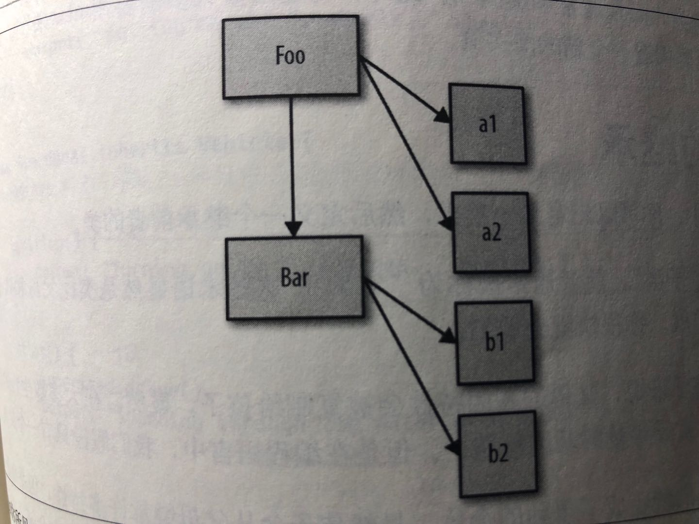

## 第4章：混合对象”类“

和类相关的面向对象编程。

面向类的设计模式：实例化（instantiation）、继承（inheritance）和（相对）多态（polymorphism）。

这些概念实际上无法直接对应到JavaScript的对象机制。许多JavaScript开发者所使用的的解决方法：如混入、mixin。


### 4.1 类理论

类描述了一种代码的组织结构形式——一种在**软件中**对**真实世界中**问题领域的建模方法。

强调的是数据和操作数据的行为本质上是互相关联的，因此**好的设计就是把数据以及和它相关的行为打包**（封装）起来。

我们还可以使用类对数据结构进行分类，可以把任意数据结构看作范围更广的定义的一种特例。如：”汽车“可以被看作”交通工具“的一种特例。Car的定义就是对通用Vehicle定义的特殊化（inherit/extend）

虽然Vehicle和Car会定义相同的方法，但是实例中的数据可能是不同的，比如每辆车独一无二的VIN（车辆识别号码）等等。

这就是**类、继承和实例化**。

类的另一个核心概念是**多态**。即，父类的通用行为可以被子类用更特殊的行为重写。**相对多态性**允许我们从重写行为中引用基础行为。

类理论强烈建议父类和子类使用相同的方法名来表示特定的行为，从而让子类重写父类。（在JavaScript代码中这样做会降低代码的可读性和健壮性）。

#### 4.1.1 ”类“设计模式

讨论的最多的是面向对象设计模式，如迭代器模式、观察者模式、工厂模式、单例模式，等。**似乎**面向对象是优秀代码的基础。

过程化编程

函数式编程

有些语言（如Java）并不会给你选择的机会，类并不是可选的——万物皆是类。有些语言（如C/C++或PHP）会提供过程化和面向类这两种语法，开发者可任选其一或者混用。

#### 4.1.2 JavaScript中的”类“

在之前，JavaScript只有一些近似类的语法元素（如new和instanceof），在后来的ES6中新增了一些元素（如class关键字）

由于类是一种设计模式，所以我们可以用一些方法近似实现类的功能。

总结一下，在软件设计中类是一种可选的模式。


### 4.2 类的机制

在许多面向类的语言中，”标准库“会提供Stack类。Stack类内部会有一些变量来存储数据，同时会提供一些公有的可访问行为（”方法“），从而让我们的代码可以和（隐藏的）数据进行交互（如添加、删除数据）。但实际上我们并不是直接操作Stack，Stack类仅仅是一个抽象的表示。

#### 4.2.1 建造

”类“和”实例“的概念来源于房屋建造。

建筑师会规划出一个建筑的所有特性：多宽、多高、多少个窗户以及窗户的位置，甚至连建造墙和房顶需要的材料都要计划好。（不关心建筑里的内容：家具、壁纸等）

建筑蓝图只是建筑计划，并不是真正的建筑，我们还需要一个建筑工人来**建造**建筑。——他会把规划好的特性从蓝图中**复制**到现实世界的建筑中。

完成后，建筑就成为了蓝图的物理实例，**本质上就是对蓝图的复制**。——我们可以通过蓝图（类）了解建筑的结构，但如果想打开一扇门，就必须接触真实的建筑（实例）。——这个对象就是类中描述的所有特性的一份副本。

类通过**复制操作**被实例化为对象形式：



#### 4.2.2 构造函数

类实例是由**一个特殊的类方法**构造的，这个方法名通常和类名相同，被称为构造函数（其任务就是初始化实例需要的所有信息（状态））。

```javascript
// 伪代码
class CoolGuy {
  specialTrick = nothing;

	CoolGuy (trick) {
    specialTrick = trick;
  }

	showOff () {
    output(" Here's my trick: ", specialTrick );
  }
}

// 调用类构造函数来生成一个CoolGuy实例
Joe = new CoolGuy( "jumping rope" );
Joe.showOff();
```

执行 `new CoolGuy()`时实际上调用的就是CoolGuy类的CoolGuy()构造函数。构造函数会返回一个对象（也就是类的一个实例）。

类构造函数属于类。此外，构造函数大多需要用new来调，这样语言引擎才知道你想要构造一个新的类实例。


### 4.3 类的继承

在面向类的语言中，可以先定义一个类，然后定义一个继承前者的类。

后者通常被称为”子类“，前者通常被称为”父类“。

定义好一个子类之后，相对于父类来说它就是一个独立且完全不同的类。子类会包含父类行为的原始副本，但是也可以重写所有继承的行为甚至定义新行为。

非常重要的一点是，父类和子类并不是实例。实际上应当把父类和子类称为父类DNA和子类DNA。

```javascript
// 一段伪代码
class Vehicle {
  engines = 1;
	ignition() {
    output( "Turning on my engine." );
  }
	drive() {
    ignition();
    output( "Steering and moving forward!" );
  }
}
class Car inherit Vehicle {
  wheels = 4; // add
  drive() { // override
    inherited:drive();
    output( "Rolling on all ", wheels, "wheels!" );
  }
}
class SpeedBoat inherit Vehicle {
  engines = 2; // override
  ignition() { // override
    output( "Turning on my ", engines, +" engine." );
  }
  pilot() { // add
    inherited:drive();
    output( "Speeding through the water with ease!" );
  }
}
```

我们不可能制造一个通用的”交通工具“，因为这个类只是一个抽象的概念。

#### 4.3.1 多态

上例中，`Car`重写了继承自父类的`drive()`方法，但是之后`Car`调用了`inherited:drive()`方法，这表明`Car`可以引用继承来的原始`drive()`方法。

这个技术被称为**多态**或者**虚拟多态**。在本例中，更恰当的说法是**相对多态**。

”相对“只是多态的一个方面。之所以说”相对“是因为我们并**不会定义**想要访问的绝对继承层次（或者说类），而是使用相对引用”查找上一层“。

多态的另一个方面是，在继承链的不同层次中一个方法名可以被多次定义，当调用方法时会**自动选择**合适的定义。

在传统的面向类的语言中**`super`**还有一个功能，就是从子类的构造函数中通过`super`可以直接调用父类的构造函数。对于真正的类来说，构造函数是属于类的。——然而，在JavaScript中，实际上”类“是属于构造函数的（函数的构造调用）。JavaScript中父类和子类的关系只存在于两者构造函数对应的.prototype对象中，因此它们的构造函数之间并不存在直接联系，从而无法简单地实现两者的相对引用。

上例中，在`pilot()`中通过**相对多态**引用了（继承来的）Vehicle中的`drive()`方法，。但那个`drive()`方法直接通过名字（而不是相对引用）引用了`ignition()`方法。那么语言引擎会使用哪个`ignition()`呢？？实际上它会使用`SpeedBoat`的`ignition()`。——`ignition()`方法定义的**多态性**取决于你是在哪个类的实例中引用它。

在子类（不是子类实例）中也可以相对引用它继承的父类，这种相对引用通常被称为`super`。

子类得到的仅仅是继承父类行为的一份副本。子类对继承到的一个方法进行”重写“，不会影响父类中的方法，这两个方法互不影响，因此才能使用**相对多态**引用访问父类中的方法。

多态并不表示子类和父类有关联，子类得到的只是父类的一份副本。类的继承其实就是**复制**。

#### 4.3.2 多重继承

有些面向类的语言允许你继承多个”父类“。多重继承意味着所有父类的定义都会被复制到子类中。——可以把许多**功能组合**在一起。——但是同时也会带来很多问题，比如，两个父类中定义了**同名方法**，子类引用的是哪个呢？这样多态继承的很多优点就不存在了。

相比之下，JavaScript要简单的多：它本身并不提供”多重继承“功能。


### 4.4 混入

JavaScript版的”继承“

在继承或者实例化时，JavaScript的对象机制并不会**自动执行**复制行为。——简单来说，JavaScript中只有对象，并不存在可以被实例化的”类“。一个对象并**不会被复制**到其他对象，它们会被**关联起来**。

JavaScript开发者想出了一个方法来**模拟**类的复制行为，这个方法就是**混入**。

#### 4.4.1 显式混入

手动实现复制功能。这个功能在许多库和框架中被称为`extend(...)`，但是为了方便理解此处称之为`mixin(...)`。🌰：

```javascript
function mixin(sourceObj, targetObj) {
  for (var key in sourceObj) {
    if(!(key in targetObj)) { // 只在属性不存在的情况下复制
      targetObj[key] = sourceObj[key];
    }
  }
  return targetObj;
}
var Vehicle = {
  engines: 1,
  ignition: function () {
    console.log( "Turning on my engine." );
  },
  drive: function () {
    this.ignition();
    console.log( "Steering and moving forward!" );
  }
};
var Car = mixin(Vehicle, {
  wheels: 4,
  drive: function () {
    Vehicle.drive.call(this);
    console.log( "Rolling on all "+ this.wheels + "wheels!" );
  }
});
```

上例中，我们处理的不是类，因为JavaScript中不存在类，Vehicle和Car都是对象，供我们分别进行复制和粘贴。

现在Car中就有了一份Vehicle属性和函数的副本了。从技术角度来说，函数实际上没有被复制，复制的是函数引用。

1. 再说多态

   `Vehicle.drive.call(this)`。这就是所说的**显式多态**。

   之前伪代码中的`inherited:drive()`，我们称之为**相对多态**。

   JavaScript（在ES6之前）并没有相对多态的机制。由于Car和Vehicle里都有drive函数，为了指明调用对象，必须使用绝对引用。

   正是由于存在标识符重叠，所以必须使用更加复杂的显式伪多态方法。

   在JavaScript中使用显式伪多态会在所有需要使用（伪）多态引用的地方创建一个函数关联，这会极大地增加维护成本。此外，由于显式伪多态可以模拟多重继承，所以会进一步增加代码的复杂度和维护难度。

   **使用伪多态通常会导致代码变得复杂、难以阅读且难以维护，应尽量避免使用**。

2. 混合复制

   由于我们是在目标对象初始化之后才进行复制，因此一定要小心不要覆盖目标对象的原有属性。

   `if(!(key in targetObj))`

   如果是先进行复制然后对Car进行特殊化的话，就可以跳过存在性检查。不过此种方法效率更低。

   这两种方法都可以把不重叠的内容从Vehicle中显性复制到Car中。”**混入**“这个名字来源于这个过程的另一种解释：Car中混合了Vehicle的内容。

   复制操作完成后，Car就和Vehicle分离了，向Car中**添加属性不会影响**Vehicle，反之亦然。（但引用同一个对象如数组，仍会互相影响）

   JavaScript中的函数无法（用标准、可靠的方法）真正地复制，所以**只能**复制对共享函数对象的引用。

   显式混入是JavaScript中一个很棒的机制，但其实并不能带来太多的好处，无非就是少几条定义语句，而且还会带来上述提到的函数对象引用问题。

   如果向目标对象中显式混入多个对象，就可以部分模仿**多重继承**行为，但仍没有直接的方式来处理函数和属性的同名问题。

   **只在能够提高代码可读性的前提下使用显式混入**。

3. 寄生继承

   显式混入模式的一种变体被称为”寄生继承“，它既是显式的又是隐式的。🌰：

   ```javascript
   // 传统的JavaScript类 - Vehicle
   function Vehicle() {
     this.engines = 1;
   }
   Vehicle.prototype.ignition = function () {
     console.log( "..." );
   }
   Vehicle.prototype.drive = function () {
     this.ignition();
     console.log( "xxx" );
   }
   
   function Car() {
     var car = new Vehicle();
     car.wheels = 4; // 对car进行定制
     var vehDrive = car.drive; // 保存Vehicle.drive的特殊引用
     car.drive = function () { // 重写drive
       vehDrive.call( this );
       console.log( "qqq" );
     }
     return car;
   }
   
   var myCar = new Car();
   myCar.drive();
   ```

   **首先我们复制一份Vehicle父类（对象）的定义，然后混入子类（对象）的定义（如果需要的话保留父类的特殊引用），然后用这个复合对象构建实例。**

   注：使用`new Car()`会创建一个新对象并绑定到this上，但是此处我们使用了自己创建的car对象，所以最初被创建的对象会被丢弃，不使用`new`关键字可以避免创建并丢弃多余的对象。

#### 4.4.2 隐式混入

无mixin

与显式伪多态类似。

```javascript
var Something = {
  cool: function () {
    this.greeting = "hhaha";
    this.count = this.count? this.count + 1: 1;
  }
};
Something.cool();
Something.greeting;
Something.count;

var Another = {
  cool: function () {
    Something.cool.call( this ); // 隐式把Something混入Another
  }
}
Another.cool();
Another.greeting;
Another.count;
```

通过在构造函数调用或者方法调用中使用`Something.cool.call( this );`，实际上“借用”了函数`Something.cool()`并在Another的上下文中调用了它。因此，我们把`Something`的行为“混入”到了Another中。

这类技术**利用了`this`的重新绑定功能**，但`Something.cool.call( this )`仍然**无法变成相对（更灵活的）引用**。应尽量避免使用，以保证代码的整洁和可维护性。


### 4.5 小结

类是一种设计模式。许多语言提供了对于面向类软件设计的原生语法。

类意味着复制。

传统的类**被实例化时**，它的行为会被复制到实例中。类**被继承时**，行为也会被复制到子类中。

**多态**（在继承链的不同层次名称相同但是功能不同的函数）**看起来**似乎是从子类引用父类，但**本质上**引用的其实是复制的结果。

JavaScript并不会（像类那样）自动创建对象的副本。

混入模式（显式或隐式）可以用来模拟类的复制行为，但通常会产生丑陋且脆弱的语法，使代码难以读懂和维护。

显式混入**实际上无法完全模拟类的复制行为**，因为对象只能复制引用，无法复制被引用的对象或者函数本身。

在JavaScript中模拟类可能会埋下隐患。