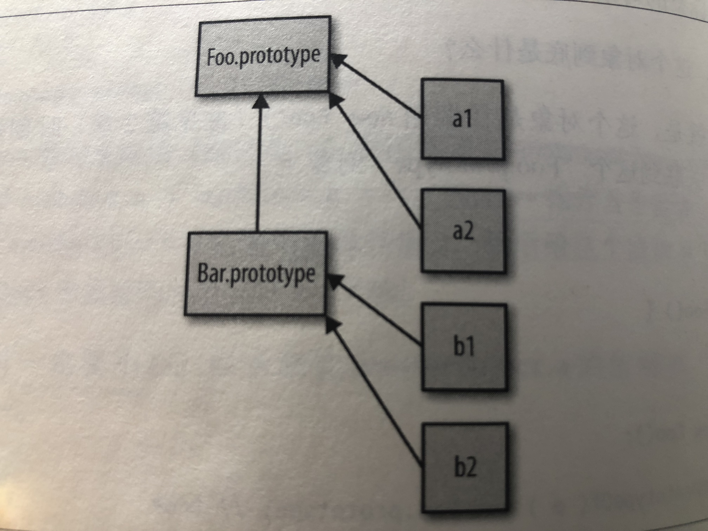

## 第5章：原型

第4章中介绍的所有模拟类**复制行为**的方法，如各种混入，都没有使用[[Prototype]]链机制。

### 5.1 [[Prototype]]

JavaScript中的对象有一个特殊的[[Prototype]]内置属性，其实就是对于其他对象的引用。

**几乎所有的对象在创建时[[Prototype]]属性都会被赋予一个非空的值**。

注：对象的[[Prototype]]链接可以为空，但是很少见。

```javascript
var myObject = {
  a: 2
};
myObject.a; // 2
```

当试图引用对象的属性时会触发[[Get]]操作。（注：如果包含Proxy的话，这里对[[Get]]和[[Put]]的讨论就不适用）

如果`a`不在 `myObject`中，就需要使用对象的[[Prototype]]链了。

```javascript
var another = {
  a: 2
};
var myObject = Object.create( another );
console.log( myObject.a ); // 2 

for (var v in myObject) {
	console.log( "found: " , v );
}
// found:  a
console.log( "a" in myObject ); // true
```

现在`myObject`对象的[[Prototype]]关联到了`another`。`myObject`的`a`不存在，但是属性访问成功地找到了值2。

**查找`a`的过程**会持续到找到匹配的属性名或者查找完**整条**[[Prototype]]链。如果查找完也没有，[[Get]]操作的返回值就是undefined。

#### 5.1.1 Object.prototype

所有普通的[[Prototype]]链最终都会指向内置的`Object.prototype`。它包含JavaScript中许多通用的功能。

#### 5.1.2 属性设置和屏蔽

给一个对象设置属性并不仅仅是添加一个新属性或者修改已有的属性值。

`myObject.foo = "bar";`

1. `myObject`对象中包含名为`foo`的普通**数据访问**属性 => 就只修改已有的属性值。

2. `foo`不直接存在于`myObject`中，[[Prototype]]链就会被遍历。

   1. 如果在原型链上找不到`foo`，`foo`就会被直接添加到`myObject`上；

   2. 如果`foo`存在于原型链上层

      1. 如果是普通**数据访问**属性且不是只读，就会直接在`myObject`中添加一个名为`foo`的新属性，它是***屏蔽属性***。// 可被添加

      2. 如果是普通**数据访问**属性且是只读，则无法修改已有属性或者在`myObject`上创建屏蔽属性。（严格模式下会抛出Error）// 无法修改原型链上的值，使用Object.defineProperty可添加属性和值

         **myObject对象会因为继承链上层中有一个只读foo就不能使用=操作符添加foo属性？？？**

      3. 如果存在且是一个`setter`，就一定会调用这个`setter`。不会被添加到`myObject`，也不会重新定义`foo`这个setter。 // myObject可调用这个setter，使用Object.defineProperty可添加

      4. **如果希望在2、3中也屏蔽foo**，就不能使用=操作符来赋值，而是使用`Object.defineProperty(...)`来向`myObject`添加`foo`。

3. 如果属性名即出现在`myObject`中也出现在`myObject`的[[Prototype]]链上层，就会**发生屏蔽**。foo总是会选择原型链中最底层的foo属性。// 只修改myObject中的foo的值

如果需要对屏蔽方法进行委托的话，就不得不使用丑陋的显式伪多态。=> 使用屏蔽得不偿失。

**有些情况下会隐式产生屏蔽。**如：

```javascript
var another = {
  a: 2
};
var myObj = Object.create( another );
console.log( another.hasOwnProperty('a') ); // true
console.log( myObject.hasOwnProperty('a') ); // false
myObject.a ++; // 隐式屏蔽！！
console.log( another.a ); // 2
console.log( myObject.a ); // 3
console.log( another.hasOwnProperty('a') ); // true
console.log( myObject.hasOwnProperty('a') ); // true
```

`myObject.a ++`相当于 `myObject.a = myObject.a + 1;`。修改委托属性一定要小心！


### 5.2 “类

[[Prototype]]”不是“什么。

JavaScript才是真正应该被称为”面向对象“的语言，因为它是少有的可以不通过类，直接创建对象的语言。

在JavaScript中，类无法描述对象的行为（因为根本就不存在类！），对象直接定义自己的行为。

#### 5.2.1 ”类“函数

JavaScript中有一种奇怪的行为——模仿类。

这种”类似类“的行为利用了函数的一种特殊特性：所有的函数**默认**都会拥有一个名为prototype的**公有且不可枚举**的属性，它会指向另一个对象：

```javascript
function Foo() {}
console.log( Foo.prototype ); // {}
```

这个对象通常被称为`Foo`的原型。

这个对象到底是什么？？？最直接的解释就是，这个对象是在调用`new Foo()`时创建的，最后会被关联到这个"Foo.prototype"对象上。（？？）

```javascript
var a = new Foo();
console.log( Object.getPrototypeOf( a ) === Foo.prototype ); // true
```

在调用`new Foo()`时会创建a，其中一步就是**将a内部的[[Prototype]]链接到`Foo.prototype`所指向的对象**。

 在面向类的语言中，类可以被复制（或者说实例化）多次，就像用模具制作东西一样。但在JavaScript中，我们不能创建一个类的多个实例，只能创建多个对象，**它们[[Prototype]]关联的是同一个对象**。在默认情况下并不会进行复制，因此这些对象之间并不会完全失去联系，它们是互相关联的。

`new Foo()`只是让两个对象互相关联。但这个函数调用实际上并没有**直接**创建关联，这个关联只是一个意外的副作用（？）。只是间接完成了我们的目标：一个关联到其他对象的新对象。

更直接的方法：`Object.create(...)`

**关于名称**

在JavaScript中，我们并不会将一个对象（”类“）复制到另一个对象（”实例“），只是将它们关联起来。（从右到左，从下到上）



这个机制通常被称为**原型继承**。这个名称主要是为了对应面向类的世界中”继承“的意义。

这个容易混淆的组合术语”原型继承“严重影响了大家对于JavaScript机制真实原理的理解。

继承意味着复制操作，JavaScript（默认）并不会复制对象属性。相反，JavaScript会在两个对象之间创建一个关联，这样一个对象就可以通过**委托**访问另一个对象的属性和函数。

还有个偶尔会用到的JavaScript术语**差异继承**。基本原则是：在描述对象行为时，使用其**不同于**普遍描述的特指。如：汽车是有四个轮子的一种交通工具，但不会重复描述交通工具具备的通用特性（如引擎）。它忽略了一个事实，实际上对象B并不是被差异构造出来的，我们只是定义了B的一些指定特性，其他没有定义的东西都变成了”洞”，而这些洞（缺少定义的空白处）最终会被委托行为“填满”。（并不会通过复制生成）

#### 5.2.2 “构造函数”

关键字`new`

`Foo.prototype`默认有一个**公有且不可枚举**的属性`constructor`，这个属性引用的是对象关联的函数。

通过“构造函数”调用`new Foo()`创建的对象也有一个`contructor`属性，指向“创建这个对象的函数”。

实际上a本身并没有`constructor`属性。这个属性也并不是表示a是由Foo“构造”。

“类”名首字母要大写，似乎也提示它是一个“类”。

**构造函数还是调用？**

实际上，Foo和程序中的其他函数没有任何区别。前面加上`new`关键字之后，就会把这个函数调用变成一个“构造函数调用”。实际上，`new`会**劫持**所有普通函数并用构造对象的形式来调用它。（无论如何都会构造一个对象）

所以，在JavaScript中对于“构造函数”最准确的解释是，所有带`new`的函数调用。

函数不是构造函数，但是当且仅当使用`new`时，函数调用会变成“**构造函数调用**”。

#### 5.2.3 技术

模仿类的行为：

```javascript
function Foo(name) {
  this.name = name;
}
Foo.prototype.myName = function () {
  return this.name;
}
var a = new Foo("a");
var b = new Foo("b");
console.log( a.myName() ); // a
console.log( b.myName() ); // b
```

`this.name = name;`给每个对象都添加了name属性，有点像类实例封装的数据值。而且`a.myName()`看起来似乎创建a和b时会把`Foo.prototype`对象复制到这两个对象中。=> [[Get]]默认算法

**回顾”构造函数“**

实际上，`.constructor`引用同样被委托给了`Foo.prototype`，而`Foo.prototype.constructor`默认指向Foo。

把`constructor`属性指向`Foo`看作是a对象由Foo”构造“非常容易理解，但这只不过是一种虚假的安全感。这和”构造“毫无关系。

`Foo.prototype`的`constructor`属性只是Foo函数在声明时的默认属性。如果我们创建了一个新对象并替换了函数默认的`prototype`对象引用，那么新对象并不会自动获得`constructor`属性。

```javascript
Foo.prototype = {};
var a1 = new Foo();
console.log( a1.constructor === Foo ); // false
console.log( a1.constructor == Object ); // true
```

当然我们可以给`Foo.prototype`添加一个`constructor`属性，不过这需要手动添加一个符合正常行为的不可枚举属性（Object.defineProperty）。

修复`constructor`需要很多手动操作。所有这些工作都是源于把”constructor“错误地理解为”由。。构造“。

`constructor`并不是一个不可变属性。它不可枚举，但**它的值是可写的**（可被修改）。

一些随意的对象属性引用，如`a1.constructor`，实际上是不被信任的。（一个非常不可靠且不安全的引用）要尽量避免使用这些引用。


### 5.3 （原型）继承

如果没有”继承“机制的话，JavaScript中的类就只是一个空架子。

`a`可以”继承“`Foo.prototype`并访问`Foo.prototype`的`myName()`函数。之前我们只把继承看作是类和类之间的关系，并没有把它看作是类和实例之间的关系。

上图中，不仅展示出对象a1到Foo.prototype的委托关系，还展示出Bar.prototype到Foo.prototype的委托关系，而后者与类继承很相似。图中**由下到上的箭头**表明这是委托关联，不是复制操作。

```javascript
function Foo(name) {
	this.name = name;
}
Foo.prototype.myName = function () {
	return this.name;
}
function Bar(name, label) {
	Foo.call( this, name );
	this.label = label;
}
// 创建一个新的Bar.prototype对象并关联到Foo.prototype;
Bar.prototype = Object.create( Foo.prototype );

Bar.prototype.myLabel = function () {
	return this.label;
}
var a = new Bar( "a", "obj a" );
console.log( a.myName() ); // a
console.log( a.myLabel() ); // obj a
```

`Bar.prototype = Object.create( Foo.prototype );`

调用**`Object.create(..)`**会凭空创建一个新对象并把新对象内部的[[Prototype]]关联到你指定的对象（本例中是Foo.prototype)。即此处是，”创建一个新的Bar.prototype对象并把它关联到Foo.prototype“（默认的原始的Bar.prototype关联对象会被抛弃掉->垃圾回收）。

**对比：**

1. Bar.prototype = Foo.prototype;

   并不会创建一个关联到Bar.prototype的**新**对象，只是直接引用Foo.prototype。对Bar.prototype。myLabel的赋值会直接修改Foo.prototype对象本身。

2. Bar.prototype = new Foo();

   可能会产生一些副作用（如写日志、修改状态等），会影响到Bar()的”后代“。

使用`Object.create(..)`唯一的缺点就是需要创建一个新对象然后把旧对象抛弃掉（需要进行垃圾回收），不能直接修改已有的默认对象。

在ES6之前，只能通过设置`__proto__`属性来**修改对象的[[Prototype]]**，但这个方法并不是标准且无法兼容所有浏览器；**ES6中**添加了辅助函数Object.setPrototypeOf(...)，可以用标准且可靠的方法来修改关联（修改，不需要抛弃默认的Bar.prototype，可见constructor）。

`Object.setPrototypeOf( Bar.prototype, Foo.prototype );`

#### 检查”类“关系

假设有对象a，如何寻找对象a委托的对象（如果存在）？

传统面向类环境中，检查一个实例（JavaScript中的对象）的继承祖先（JavaScript中的委托关联）通常被称为**内省**（或者**反射**）。

如何通过内省找出a的”祖先“（委托关联）呢？

1. 站在”类“的角度来判断：`a instanceof Foo;` // true

   instanceof操作符的左操作数是一个普通的对象，右操作数是一个函数。**instanceof回答的问题**：在a的**整条**[[Prototype]]链中是否有指向Foo.prototype的对象？

   此方法只能处理对象和函数（带.prototype引用的Foo）之间的关系。如果想判断两个对象之间是否通过[[Prototype]]链关联，只用instanceof无法实现。

   注：使用内置的`bind(..)`函数来生成一个硬绑定函数的话，目标函数的.prototype会代替硬绑定函数的.prototype。在硬绑定函数上使用`instanceof`也相当于直接在目标函数上使用`instanceof`。

2. `Foo.prototype.isPrototypeOf(a);` // true

   这里我们实际上并不关心（甚至不需要）Foo，只需要一个可以用来判断的对象（Foo.prototype）就行。**isPrototypeOf回答的问题**：在a的**整条**[[Prototype]]链中是否出现过Foo.prototype？

   这里并不需要间接引用函数Foo，它的`prototype`属性会被自动访问。

   只需要两个对象就可以判断它们之间的关系。如：`b.isPrototypeOf( c );` // b是否出现在c的[[Prototype]]链中？

   我们也可以**直接获取一个对象的[[Prototype]]链**。在<u>ES5中，标准的方法</u>是：**`Object.getPrototypeOf( a );`**  绝大多数浏览器也支持**一种非标准的方法来访问内部[[Prototype]]属性：`__proto__`。**`__proto__`和`constructor`一样，实际上存在于内置的`Object.prototype`中，而且更像一个getter/setter。通常来说我们不需要修改已有对象的[[Prototype]]。

注：ES6中的class关键字可以在内置的类型（如Array）上实现类似“子类”的功能。

最好把[[Prototype]]对象关联看作是只读属性，从而增加代码的可读性。


### 5.4 对象关联

[[Prototype]]机制就是存在于对象中的一个内部链接。

**这个链接的作用是**：如果在对象上没有找到需要的属性或者方法引用，引擎就会继续在[[Prototype]]关联的对象上进行查找。以此类推，这一系列对象的链接被称为“**原型链**”。

#### 5.4.1 创建关联

[[Prototype]]机制的意义？为什么JavaScript开发者费这么大的力气（模拟类）在代码中创建这些关联呢？

`Object.create(...)`

```javascript
var foo = {
  something: function () {
    console.log( "Tell me something good ..." );
  }
};
var bar = Object.create( foo );
bar.something(); // Tell me something good ...
console.log( bar.__proto__ ); // {something: ƒ}
console.log( bar.constructor ); // ƒ Object() { [native code] }
```

`Object.create(...)`会**创建一个新对象（bar）并把它关联到我们指定的对象（foo），这样我们就可以充分发挥[[Prototype]]机制的威力（委托）**而且避免不必要的麻烦（如使用new的构造函数调用会生成.prototype和.constructor引用）。

注：**Object.create(null)**会创建一个拥有空（null）[[Prototype]]链接的对象，这个对象无法进行委托。这些特殊的空[[Prototype]]对象通常被称作“字典”，它们完全不会受到原型链的干扰，因此**非常适合用于存储数据**。

我们并不需要类来创建两个对象之间的关系（not new, but Object.create(...)）

**!! Object.create(...)的polyfill代码**

Object.create(...)是在ES5中新增的函数，在ES5之前的环境中（如旧IE）需要使用一段简单的polyfill代码，它**部分实现**了Object.create(...)的功能：

```javascript
if(!Object.create) {
  Object.create = function (o) {
    function F() {}
    F.prototype = o;
    return new F(); // 一个新对象，proto指向o
  }
}
```

以上代码使用了一个一次性函数F，通过改写它的prototype属性使其指向想要关联的对象，然后再使用`new F()`来构造一个新对象进行关联。

标准ES5中内置的`Object.create(...)`函数还提供了一系列附加功能，第二个参数指定了需要添加到新对象中的属性名以及这些属性的**属性描述符**。因为ES5之前的版本无法模拟属性操作符，所以polyfill代码无法实现这个附加功能。

```javascript
var myObj = Object.create( another, {
	b: {
		enumerable: false,
		writable: true,
		configurable: false,
		value: 3
	},
	c: {
		enumerable: true,
		writable: false,
		configurable: false,
		value: 4
	}
} );
```

通常来说并不会使用`Object.create(...)`的附加功能。（部分严谨的开发者认为只有能被完全模拟的函数才应该使用polyfill代码）。=> 如何选择取决于开发者。

#### 5.4.2 关联关系是备用

**看起来**对象之间的关联关系是处理“缺失“属性或者方法时的一种备用选项。

如果这样写只是为了让`myObj`在无法处理属性或者方法时可以使用备用的`another`，那你的软件就会变得难以理解和维护。（需要谨慎思考）

注：ES6中有一个被称为代理（Proxy）的高端功能，它实现的就是”方法无法找到“时的行为。

**可以使用内部委托替代直接委托：可以让API接口设计更加清晰**。

```javascript
var another = {
  cool: function () {
    // ...
  }
};
var myObj = Object.create( another );
myObject.doCool = function () {
  this.cool(); // 内部委托
};
myObj.doCool(); // 而不是直接执行 myObj.cool();
```

遵循的是**委托设计模式**，通过[[Prototype]]委托到`another.cool()`。


### 5.5 小结

所有普通对象都有内置的`Object.prototype`，指向原型链的顶端，如果在原型链中找不到指定的属性就会停止。

关联两个对象最常用的方法是，使用new关键词进行函数调用。带new的函数调用通常被称为”构造函数调用“，与传统面向类语言中的类构造函数不一样。

虽然JavaScript机制和传统面向类语言中的”类初始化“和”类继承“很相似，但是JavaScript中的机制有一个核心区别——不会进行复制——对象之间是通过内部的[[Prototype]]链关联的。

对象之间的关系不是复制而是**委托**。