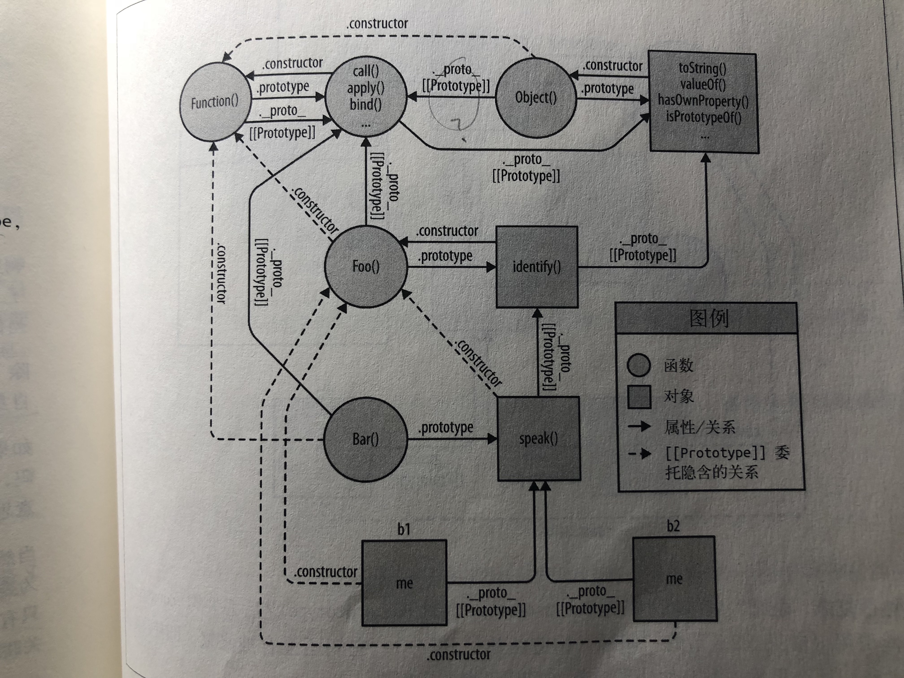
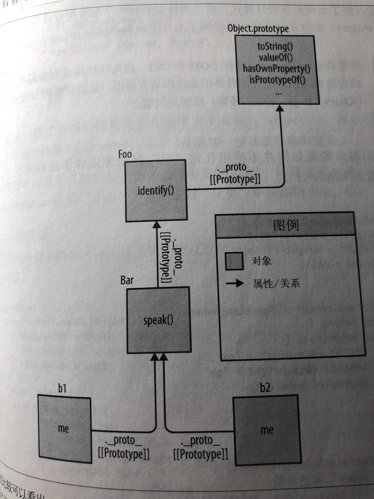

## 第6章：行为委托

第5章的结论：[[Prototype]]机制就是指对象中的一个内部链接引用另一个对象。

如果在第一个对象上没有找到需要的属性或者方法引用，引擎就会继续在[[Prototype]]关联的对象上进行查找，以此类推。这一系列对象的链接被称为”原型链“。

JavaScript中这个机制的**本质**就是对象之间的关联关系。


### 6.1 面向委托的设计（简单）

面向类的设计中有些原则（如，封装是非常有用的）依然有效。

类和继承的设计模式 => 委托行为的设计模式

#### 6.1.1 类理论

**场景：建模一些类似的任务**

如果使用类，设计方法可能是：定义一个通用父类Task，再定义子类XYZ和ABC。

**类**设计模式**鼓励**我们在继承时使用方法重写（和多态）——许多行为可以先”抽象“到父类再用子类进行特殊化（重写）。

```java
class Task {
  id;
  
  Task(ID) { id = ID; }
  outputTask() { output( id ); }
}
class XYZ inherits Task {
  label;
  
  XYZ(ID, Label) { super( ID ); label = Label; }
  outputTask() { super(); output( label ); }
}
class ABC inherits Task {
  // ...
}
```

在构造完成（实例化）后，我们通常只需要操作这些实例（而不是类），因为每个实例都有我们需要完成任务的所有行为。

#### 6.1.2 委托理论

思考同样的场景。

**首先**，定义一个名为Task的对象，它会包含所有任务都可以使用（委托）的具体行为；**接着**，对于每个任务（XYZ、ABC）都定义一个对象来存储对应的数据和行为。我们会把特定的任务对象都<u>关联到</u>Task功能对象上，让它们在需要的时候可以进行**委托**。

可以想象成，执行任务XYZ需要两个兄弟对象（XYZ和Task）协作完成。需要时可以允许XYZ对象委托给Task。

```javascript
Task = {
  setID: function (ID) { this.id = ID; },
  outputID: function () { console.log( this.id ); }
};
// 让XYZ委托Task
XYZ = Object.create( Task );
XYZ.prepareTask = function (ID, Label) {
  this.setID( ID );
  this.label = Label;
};
XYZ.outputTaskDetails = function () {
  this.outputID();
  console.log( this.label );
};
// ABC = Object.create( Task );
// ABC ...
```

这里Task和XYZ并不是类（或者函数），它们是对象。XYZ通过`Object.create(..)`创建，它的[[Prototype]]委托了Task对象。

相比面向类（面向对象），这里把这种编码风格称为**”对象关联**“（OLOO，objects linked to other objects）。真正关心的只是XYZ对象委托了Task对象。

**对象关联**风格代码的**不同之处**：

1. 在[[Prototype]]委托中最好把**状态**（如id、label）保存在委托者（XYZ、ABC）而不是委托目标（Task）上；
2. 在类设模式中，鼓励利用重写（多态）的优势。在委托行为中恰好相反：尽量**避免在[[Prototype]]链的不同级别中使用相同的命名**。（显式伪多态，笨拙且脆弱）。提倡使用更有描述性的方法名。
3. 我们和XYZ进行交互时可以使用Task中的通用方法，因为XYZ委托了Task。会沿着原型链查找属性和方法。

**委托行为**意味着某些对象（XYZ）在找不到属性或者方法引用时，会把这个请求委托给另一个对象（Task）。

注：在API接口的设计中，委托最好在内部实现，不要直接暴露出去。（内部委托不要直接委托）

##### 1.互相委托（禁止）

你**无法**在两个或两个以上互相（双向）委托的对象之间创建**循环**委托。

如果引用了一个两边都不存在的属性或者方法，那就会在[[Prototype]]链上产生一个无限递归的循环。但如果所有的引用都被严格限制的话，是可以互相委托的。

**禁止的原因**是：引擎在设置时检查一次无限循环引用要更加高效，否则每次从对象中查找属性时都需要进行检查。

##### 2.调试（浏览器相关）

浏览器和引擎可以自己选择合适的方式来进行解析（特定值或者结构的表示方式）

```javascript
// 一段传统的”类构造函数“JavaScript代码
function Foo() {}
var a1 = new Foo();
console.log( a1 ); // chrome: Foo {}    ff: Object {  }

a1.constructor; // ƒ Foo() {}
a1.constructor.name; // "Foo"
```

Chrome实际上想说的是：{}是一个空对象，由名为Foo的函数构造

FF想说的是：{}是一个空对象，由Object构造

之所以有**这种细微的差别，是因为**Chrome会动态跟踪并把**实际**执行**构造过程**的函数名当作一个内置属性。

**看起来**Chrome是直接输出了对象的.constructor.name。实际上：

```javascript
Foo.prototype.constructor = function Gotcha() {};
a1.constructor; // ƒ Gotcha() {}
a1.constructor.name; // "Gotcha"
a1; // Foo {}
```

如果把a1.constructor.name修改为另一个合理的值（Gotcha），Chrome控制台仍然会在查看a1时输出Foo。=> 不是使用.constructor.name?

另一段代码例子：

```javascript
var Foo = {};
var a1 = Object.create( Foo );
a1; // {}
Object.defineProperty( Foo, "constructor", {
  enumerable: false,
  value: function Gotcha(){}
} );
a1; // Gotcha {}
```

=> 本例又确实使用了.constructor.name？

此外，Chrome内部跟踪（只用于调试输出）”构造函数名称“的方法是Chrome自身的一种扩展行为，并不包含在JavaScript的规范中。如果使用本章所介绍的**对象关联风格**代码来编写代码，那Chrome就**无法跟踪对象内部的”构造函数名称“**，这样的对象输出是Object {}，意思是”Object()构造出的对象“。

只有使用类风格来编写代码时Chrome内部的”构造函数名称“跟踪才有意义。

#### 6.1.3 比较思维模型

两种设计模式（面向对象（new）和对象关联（Object.create）））

**面向对象风格**的代码：

```javascript
/* 面向对象风格 */
function Foo(who) {
	this.me = who;
}
Foo.prototype.identify = function () {
	return "I am " + this.me;
};

function Bar(who) {
	Foo.call(this, who);
}
Bar.prototype = Object.create( Foo.prototype );

Bar.prototype.speak = function () {
	alert( "Hello, " + this.identify() + "." );
};

var b1 = new Bar( "b1" );
var b2 = new Bar( "b2" );

b1.speak();
b2.speak();
```

b1委托了Bar.prototype，Bar.prototype委托了Foo.prototype。

**对象关联风格**的代码：

```javascript
Foo = {
	init: function (who) {
		this.me = who;
	},
	identify: function () {
		return "I am " + this.me;
	}
};
Bar = Object.create( Foo );
Bar.speak = function () {
	alert( "Hello, " + this.identify() + "." );
};
var b1 = Object.create( Bar );
b1.init( "b1" );
var b2 = Object.create( Bar );
b2.init( "b2" );

b1.speak();
b2.speak();
```

b1委托了Bar，Bar委托了Foo。仍实现了三个对象之间的关联。

首先，**类风格代码的思维模型**强调实体以及实体间的关系：



跟着图中的箭头走可以发现，JavaScript机制有很强的内部连贯性。

JavaScript中的函数之所以可以访问call(..)、apply(..)和bind(..)，就是因为函数本身是对象。而函数对象同样有[[Prototype]]属性并且关联到`Function.prototype`对象，因此所有函数对象都可以通过**委托**调用这些默认方法。

虚线表示了Bar.prototype继承Foo.prototype之后丢失的.constructor属性引用，它们还没有被修复。

**对象关联风格代码的思维模型**：



这种代码只关注一件事：对象之间的关联关系。


### 6.2 类与对象（灵活）

真实场景：Web开发中非常典型的一种前端场景：创建UI控件

#### 6.2.1 控件”类“

一个包含所有通用控件行为的父类（Widget）和继承父类的特殊控件子类（如Button）。用“类”的概念来对问题（UI控件）进行建模。

`compare-oo.html`

在面向对象设计模式中，我们需要先在父类中定义基础的`render(..)`，然后在子类中重写它。（子类并不会）

代码中出现了丑陋的显式伪多态，即通过Widget.call和Widget.prototype.render.call从“子类”方法中引用“父类”中的基础方法。

##### ES6的class语法糖

尽管语法上得到了改进，但实际上这里并没有真正的类，class仍然是通过[[Prototype]]机制实现的。

#### 6.2.2 委托控件对象

`compare-oloo.html`

使用对象关联风格委托来更简单地实现Widget/Button

**不需要把Widget和Button当作父类和子类**。相反，Widget只是一个对象，包含一组通用的函数，**任何类型的控件都可以委托**，Button同样只是一个对象。

我们定义了两个**更具描述性的方法名**：insert和build。同理，初始化方法分别叫做init和setup。

避免丑陋的显式伪多态调用，代之以简单的**相对委托调用**this.init和this.insert。

使用类构造函数的话，我们需要（通常这么建议）在同一个步骤中实现构造和初始化。然而在许多情况下，把这两步分开**更灵活**。

```javascript
var btn1 = new Button( 125, 30, "Hello" );
// vs.
var btn1 = Object.create( Button );
btn1.setup( 125, 30, "Hello" );
```

对象关联可以更好地支持关注**分离(separation of concerns)原则**，创建和初始化并不需要合并为一个步骤。


### 6.3 更简洁的设计（简洁）

对象关联：让代码看起来更简洁（且更具扩展性）、通过行为委托模式简化代码结构

场景：有两个控制器对象，一个用来操作网页中的登录表单，另一个用来与服务器进行校验（通信）。

**在传统的类设计模式中**，把基础的函数定义在名为Controller的类中，然后派生两个子类LoginController和AuthController，它们都继承自Controller并且重写了一些基础行为。`compare-oo.js`

注意AuthController需要一个LoginController的实例来和登录表单进行交互，因此这个实例变成了一个数据属性。=> 在继承的基础上进行了一些合成。

注：让AuthController继承LoginController或者相反，就通过继承链实现了真正的合成。但AuthController和LoginController都不具备对方的基础行为，所以这种继承关系是不恰当的。

##### 反类

使用对象关联风格的行为委托实现更简单的设计

`compare-oloo.js`

由于AuthController只是一个对象，因此不需要实例化，只需要一行代码就行：

`AuthController.checkAuth();`

这种模式的重点在于，只需要两个实体，而之前的模式需要三个。

1. 不需要Controller基类来“共享”两个实体之间的行为，因为委托足以满足需求
2. 不需要实例化类，因为它们根本就不是类，只是对象
3. 也不需要合成，因为两个对象可以通过委托进行合作
4. 避免了面向类设计模式中的多态（在不同的对象中没有使用相同的函数名）

**对象关联**风格代码和**行为委托**设计模式


### 6.4 更好的语法（class、简洁语法声明）

ES6的class语法可以简洁地定义类方法

```javascript
class Foo {
  methodName() {}
}
```

在ES6中，我们可以在任意对象的字面形式中使用**简洁方法声明**（concise method declaration），所以对象关联风格的对象可以这样声明（和class的语法糖一样）：

```javascript
var LoginController = {
  // ...
  getUser() {},
  // ...
};
```

唯一区别，就是对象的字面形式仍然需要使用","来分隔元素，而class语法不需要。

现在可以用对象的字面形式来改写之前繁琐的属性赋值语法，然后用Object.setPrototypeOf(...)来修改它的[[Prototype]]。

```javascript
var AuthController = {
  errors: [],
  checkAuth() {},
  server(url, data) {}
};
Object.setPrototypeOf( AuthController, LoginController );
```

##### 反词法

简洁方法有一个非常小但是非常重要的缺点：匿名。

```javascript
// 去掉语法糖之后的代码如下：
var AuthController = {
  // ...
  checkAuth: function () {}
};
```

由于函数对象本身没有名称标识符，所以`checkAuth()`的缩写形式实际上会变成一个**匿名函数表达式**并赋值给`checkAuth`属性。

匿名函数没有name标识符，会导致：

* 调用栈更难追踪
* 自我引用（递归、事件解绑等）更难
* 代码（稍微）更难理解：不知道函数功能

简洁方法没有第1和3的缺点，简洁方法很特殊，会给对应的函数对象设置一个内部的name属性，理论上可以用在追踪栈中（具体实现不同），而属性名表达了函数功能。

但它们不具备可以**自我引用**的词法标识符。通过对象直接引用在许多情况下无法使用，如使用this绑定。如果**需要自我引用的话**，最好使用传统的**具名函数表达式**来定义对应的函数，不要使用简洁方法。

```javascript
var Foo = {
  bar(x) {
    if (x < 10) {
      return bar( x * 2 );
    }
    return x;
  },
  baz: function baz(x) {
    if (x < 10) {
      return baz( x * 2 );
    }
    return x;
  }
};
Foo.bar(2); // ReferenceError: bar is not defined
Foo.baz(2); // 16
```


### 6.5 内省

内省就是检查实例的类型。主要目的，是通过创建方式来判断对象的结构和功能。

🌰：

```javascript
function Foo() {}
Foo.prototype.something = function () {};
var a1 = new Foo();
if( a1 instanceof Foo ) {
  a1.something();
}
```

`instanceof`操作告诉我们**a1是Foo“类”的一个实例。这样我们就可以认为a1有Foo“类”描述的功能。**

但Foo“类”并不存在，只有一个普通的函数Foo，它引用了a1委托的对象Foo.prototype。从语法角度来看，`instanceof`似乎检查了a1和Foo的关系，但实际上它想说的是a1和Foo.prototype（引用的对象）是互相关联的。——如果你想检查对象a1和某个对象的关系，必须使用另一个引用该对象的函数才行，不能直接判断两个对象是否关联。

```javascript
// instanceof | isPrototypeOf  查整条链
// getPrototypeOf 获取整条链

Bar.prototype instanceof Foo; // true
Object.getPrototypeOf( Bar.prototype ) === Foo.prototype; // true
Foo.prototye.isPrototypeOf( Bar.prototype ); // true

b1 instanceof Foo; // true
b1 instanceof Bar; // true
Object.getPrototypeOf( b1 ) === Bar.prototype; // true
Foo.prototype.isPrototypeOf( b1 ); // true
Bar.prototype.isPrototypeOf( b1 ); // true
```

还有一种常见但是更加脆弱的内省模式：**“鸭子类型”**——如果看起来像鸭子，叫起来像鸭子，那就一定是鸭子。

```javascript
if( a1.something ) {
  a1.something();
}
```

并没有检查a1和委托`something()`函数的对象之间的关系。

这里假设如果a1通过了测试a1.something的话，那a1就一定能调用.something()。这个假设的风险并不算高。但“鸭子类型”通常会在测试之外做出许多关于对象功能的假设。

ES6的Promise就是典型的“鸭子类型”。——出于各种原因，我们需要判断一个对象引用是否是Promise，但是判断的方法是检查对象是否有`then()`方法。

应该尽量避免使用这个方法，即使使用也要保证条件是可控的。

**对象关联风格代码**：

所有的对象都是通过[[Prototype]]委托互相关联

```javascript
Foo.isPrototypeOf( Bar ); // true
Object.getPrototypeOf( Bar ) === Foo; // true

Foo.isPrototypeOf( b1 ); // true
Bar.isPrototypeOf( b1 ); // true
Object.getPrototypeOf( b1 ) === Bar; // true
```

没有使用`instanceof`。这里想问的问题是：你是我的原型吗？


### 6.6 小结

行为委托。

行为委托认为对象之间是兄弟关系，互相委托，而不是父类和子类的关系。JavaScript的[[Prototype]]机制本质上就是行为委托机制。

对象关联的编码风格提倡的是直接创建和关联对象，不把它们抽象成类。